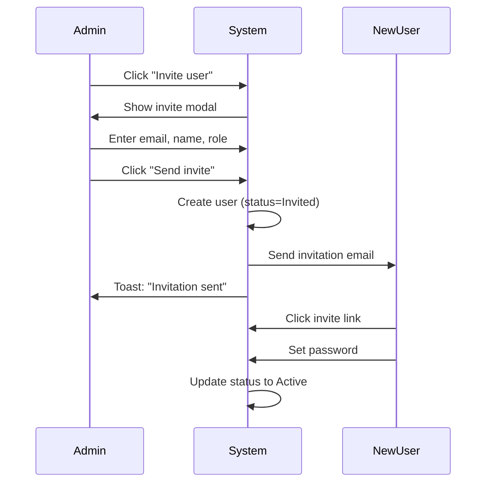

# 🎨 UX / UI SSOT — MVP1: Organization Admin & Personal User Management

**Version:** 1.0.0  
**Status:** Draft (UX-Ready for Design & Build)  
**Last Updated:** 2025-12-02  
**Scope:** Login, Logout, Forgot/Reset Password, Organization Profile, User Management, "My Profile"

---

## 0. Design Philosophy

> "A user should never wonder: _What is this? Where do I do that? Who should use this? When should I use it?_"

MVP1 is the **identity spine** of AI-BOS. The UI must:

- Feel **calm, obvious, and trustworthy**
- Hide all complexity of tenants, roles, and traceability behind **human language**
- Make it **impossible to misconfigure** access "by accident"

We keep everything:

- **Job-first** ("Manage my organization", "Invite a colleague", "See what I can access")
- **Role-aware** (Platform Admin vs Org Admin vs Member vs Viewer)
- **Traceability-aware** without overwhelming (subtle history cues, not raw audit logs)

---

## 1. Screen Inventory

### 1.1 Authentication Shell

| #   | Screen               | Route                   | Description                                |
| --- | -------------------- | ----------------------- | ------------------------------------------ |
| 1   | **Login**            | `/auth/login`           | Primary entry point                        |
| 2   | **Forgot Password**  | `/auth/forgot-password` | Password recovery initiation               |
| 3   | **Reset Password**   | `/auth/reset-password`  | Password reset with token                  |
| 4   | **Logged-out State** | `/auth/logout`          | (Optional) "You've been logged out" screen |

### 1.2 Organization Management

| #   | Screen                    | Route                 | Access                       |
| --- | ------------------------- | --------------------- | ---------------------------- |
| 5   | **Organization Settings** | `/admin/organization` | Org Admins & Platform Admins |

### 1.3 User Management

| #   | Screen             | Route              | Purpose                          |
| --- | ------------------ | ------------------ | -------------------------------- |
| 6   | **User Directory** | `/admin/users`     | Main "people" hub for the tenant |
| 7   | **User Detail**    | `/admin/users/:id` | Individual user control room     |

### 1.4 Personal Area

| #   | Screen         | Route               | Access                            |
| --- | -------------- | ------------------- | --------------------------------- |
| 8   | **My Profile** | `/settings/profile` | All users (member, viewer, admin) |

---

## 2. Primary Layout Pattern

Consistent shell across MVP1 screens:

### Top Navigation

- Logo / product name
- Tenant switcher (if multi-tenant)
- Links: "Organization", "Users", "Payments" (later), etc.
- User menu (avatar → "My Profile", "Logout")

### Side Navigation (Admin Areas)

- **Organization**
- **Users**
- (Future modules; disabled or lower priority)

### Content Area

- Max-width content (no full-width readability issues)
- Card-based layout
- Clear hierarchy by typographic scale and spacing

---

## 3. Screen Definitions

### 3.1 Login – `/auth/login`

**Goal:** Get user into the system with maximum clarity and minimum friction.

**Layout:**

- Clean split layout:
  - Left: short brand/story ("AI-BOS · Your governed ERP OS")
  - Right: login card

**Login Card:**

| Element            | Details                                                          |
| ------------------ | ---------------------------------------------------------------- |
| **Fields**         | Email, Password                                                  |
| **Primary Action** | "Log in" button                                                  |
| **Secondary Link** | "Forgot your password?" → `/auth/forgot-password`                |
| **Subtext**        | "By logging in, you agree to your organization's data policies." |

**Error Messages (Human-Friendly):**

- ✅ "Email or password is incorrect. Please try again."
- ❌ "Error code: AUTH_001" (No tech codes!)

---

### 3.2 Forgot Password – `/auth/forgot-password`

Simple and reassuring:

| Element             | Details                                                                                                 |
| ------------------- | ------------------------------------------------------------------------------------------------------- |
| **Field**           | Email                                                                                                   |
| **Button**          | "Send reset link"                                                                                       |
| **Success Message** | "If an account exists for jack@example.com, we've sent a reset link. Check your inbox and spam folder." |

> **Security:** No hint about whether the email exists (security best practice).

---

### 3.3 Reset Password – `/auth/reset-password?token=…`

| Element        | Details                                                        |
| -------------- | -------------------------------------------------------------- |
| **Fields**     | New password, Confirm password                                 |
| **Button**     | "Set new password"                                             |
| **Validation** | Live feedback: "Good password" / "Too weak" (not overly noisy) |
| **Success**    | "Your password has been updated. You can now log in."          |
| **CTA**        | "Go to login" button                                           |

---

### 3.4 Organization Settings – `/admin/organization`

This is the "profile page" of the tenant.

**Page Header:**

- Title: "Organization Settings"
- Subtitle: "Basic information about your company in AI-BOS."

**Card Sections:**

| Section                   | Fields                                                                                    |
| ------------------------- | ----------------------------------------------------------------------------------------- |
| **Organization Identity** | Name, Legal name (optional), Logo upload, Business registration number (optional)         |
| **Regional Settings**     | Time zone (dropdown), Default currency (read-only for MVP1), Locale / date format preview |
| **Contact & Ownership**   | Primary contact name & email, Support email (if different)                                |

**Actions:**

- Primary: **"Save changes"** (sticky at bottom on scroll)
- Secondary: **"Reset to last saved"**

**Microcopy:**

- "This name appears on your workspace and system emails."

**Subtle History:**

> "Last updated by Cindy 3 hours ago." (Data from audit_events, but friendly)

---

### 3.5 User Directory – `/admin/users`

The **people hub** for the organization.

**Top Section:**

- Page title: "Users"
- Subtitle: "Everyone who can sign in to this organization."
- Primary button: **"Invite user"** → opens invite modal

**Job-Based Lanes (Tabs):**

| Lane                  | Description                                       |
| --------------------- | ------------------------------------------------- |
| **All Users**         | Complete user list                                |
| **New & Active**      | Joined in last 30 days or currently active        |
| **Admins & Owners**   | Users with elevated roles (Org or Platform Admin) |
| **Inactive / Locked** | Deactivated or locked accounts                    |

**User Table Columns:**

| Column        | Format                                             |
| ------------- | -------------------------------------------------- |
| Avatar + Name | Profile image with name                            |
| Email         | Email address                                      |
| Role          | Pill: Platform Admin / Org Admin / Member / Viewer |
| Status        | Active / Inactive / Invited / Locked               |
| Last active   | e.g., "2d ago", "Never"                            |
| Actions       | ⋯ menu                                             |

**Quick Actions (⋯ menu):**

- "Change role"
- "Deactivate user" / "Reactivate user"
- "View details"

**Role Tooltips:**

- **Org Admin:** "Can manage organization settings and users in this tenant."
- **Viewer:** "Can view data but cannot change settings."

---

### 3.6 User Detail – `/admin/users/:id`

This is the **control room** for a single account.

**Layout:** Two-column

| Left Column              | Right Column                   |
| ------------------------ | ------------------------------ |
| User identity & controls | Access Story & recent activity |

**Left Column Cards:**

**Card: User Identity**

- Avatar, Name, Email
- Status pill (Active / Inactive / Locked)
- Button: **"Deactivate User"** or **"Reactivate User"**

**Card: Roles & Tenants**

- List of tenant memberships:
  - Tenant name
  - Role (dropdown or clickable pill)
- For single-tenant: just role selector

**Right Column:**

1. **Access Story Bar** (Silent Killer - see §5.1)
2. **Recent Activity** (simplified audit view):
   - "Joined AI-BOS 2 months ago"
   - "Last logged in 3 days ago"
   - "Promoted to Org Admin by Jack yesterday"
   - "Deactivated for [reason]"

---

### 3.7 My Profile – `/settings/profile`

For every user.

**Layout:** Two-column

| Left Column           | Right Column         |
| --------------------- | -------------------- |
| Profile & Preferences | "How AI-BOS sees me" |

**Left: Profile & Preferences**

**Card: Personal Info**

- Avatar upload
- Name
- Email (may be read-only)

**Card: Preferences**

- Time zone
- Language / locale
- Notification toggles (if MVP1 includes them)

**Right: Access Story (Silent Killer)**

- "You are a **Member** in AI-BOS Labs."
- "You can view and work on: Metadata, Payments (requests only), and Reports."
- "You cannot manage users or organization settings."

---

## 4. Key Flows

### 4.1 Flow — Invite a New User

**Modal Fields:**

- Email (required)
- Name (optional)
- Role (dropdown, default: Member)
- Subtext: "We'll send an invitation email with a secure join link."

---

### 4.2 Flow — Change Role

1. Admin opens `/admin/users` or `/admin/users/:id`
2. Selects role dropdown / clicks "Change role"
3. Simple dialog:
   - "Change role for Jack Wee"
   - Current: `Member`
   - New: dropdown of roles
   - Microcopy: short explanation of each role's power
4. Confirmation button: **"Update role"**
5. Result:
   - Role pill updates
   - Toast: "Role updated."
   - Timeline: "Role changed from Member to Org Admin by Cindy"

---

### 4.3 Flow — Deactivate / Reactivate User

**Deactivation:**

1. Admin clicks **"Deactivate User"**
2. Confirmation dialog:
   > "This will prevent Jack from logging in, but we'll keep their history and data."
   - Optional reason field (logged as an event)
3. On confirm:
   - Status pill changes to "Inactive"
   - Timeline: "Deactivated by Cindy (reason: left company)"

**Safety Rails:**

- If user is last Org Admin:
  - ⚠️ "This is the last Org Admin. You must assign another Org Admin before deactivating."
  - Prevent action unless condition met

---

### 4.4 Flow — Update My Profile

1. User opens `/settings/profile`
2. Updates name / avatar / timezone
3. Hits **"Save changes"**
4. Feedback:
   - Toast: "Profile updated."
   - Line: "Last updated just now."
5. Access Story updates if role/tenant changed

---

## 5. Silent Killer & Good-to-Haves

### 5.1 🔒 Silent Killer: **Access Story Bar**

**What it is:**

A single, natural-language sentence that summarizes:

- Who this person is in the system
- Where they exist (tenants)
- How powerful they are (roles)
- Any risk markers

**Where it appears:**

- **User Detail** (for admins)
- **My Profile** (for the user themselves)

**Examples:**

| Context        | Example                                                                                                                                    |
| -------------- | ------------------------------------------------------------------------------------------------------------------------------------------ |
| **Admin View** | "Jack is an **Org Admin** in AI-BOS Labs and a **Member** in DLBB Group HQ. He can manage users and organization settings in AI-BOS Labs." |
| **User View**  | "You are a **Member** in AI-BOS Labs. You can create and edit your own work, but you cannot manage users or organization settings."        |

**Why this is a silent killer:**

- 99% of confusion in enterprise systems comes from **"What can this user actually do?"**
- Instead of forcing admins to infer from role codes, we **speak it back** to them
- Uses traceability and membership model as source, but feels like "magic clarity"

---

### 5.2 ✅ Good-to-Have #1: **Job-Based Lanes on User Directory**

Instead of a single "All users" grid, `/admin/users` has lanes:

| Lane                  | Admin Question Answered          |
| --------------------- | -------------------------------- |
| **All Users**         | "Show me everyone"               |
| **New & Active**      | "Who just joined?"               |
| **Admins & Owners**   | "Who has dangerous powers?"      |
| **Inactive / Locked** | "Who did we lock or deactivate?" |

Each lane:

- Has the right default filters baked in
- Includes small count badges (e.g., "Admins & Owners • 3")

---

### 5.3 ✅ Good-to-Have #2: **Trust-First Deactivation UX**

**Features:**

- Clear explanation: "Deactivation stops login but keeps all history. You can reactivate later."
- Reason field (optional or recommended) for context, logged in timeline
- Auto-checks: If user is last Org Admin, **block** deactivation with clear guidance
- Banner on deactivated User Detail:
  > "This user is inactive and cannot log in. Reactivate if they return."

---

## 6. Microcopy & Interaction Rules

### Button Copy (Unambiguous)

| ✅ Do             | ❌ Don't  |
| ----------------- | --------- |
| "Invite user"     | "Add"     |
| "Save changes"    | "Submit"  |
| "Deactivate user" | "Disable" |

### Error Messages (Human-Friendly)

| ❌ Before                | ✅ After                                                          |
| ------------------------ | ----------------------------------------------------------------- |
| "Role cannot be changed" | "You don't have permission to change roles in this organization." |

### Role Tooltips

| Role               | Tooltip                                    |
| ------------------ | ------------------------------------------ |
| **Platform Admin** | "Manages all tenants and global settings." |
| **Org Admin**      | "Manages this organization and its users." |
| **Member**         | "Works inside this organization's apps."   |
| **Viewer**         | "Can only view data, not change it."       |

---

## 7. UX Definition of Done (MVP1)

MVP1 Organization Admin & Personal UI is **Done** when:

### ✅ Auth

- `/auth/login`, `/auth/forgot-password`, `/auth/reset-password` implemented with:
  - Clear copy
  - Proper error states
  - No technical leak in user-facing messages

### ✅ Organization Settings

- `/admin/organization`:
  - Shows editable org profile
  - "Last updated by [Name] [when]" hint
  - Validates mandatory fields

### ✅ User Management

- `/admin/users`:
  - Lanes: All Users, New & Active, Admins & Owners, Inactive / Locked
  - Invite flow works end-to-end

- `/admin/users/:id`:
  - Shows identity, status, roles, and **Access Story Bar**
  - Supports role change, deactivate/reactivate with safe dialogs
  - Shows "Recent Activity" summary

### ✅ My Profile

- `/settings/profile`:
  - Allows basic profile editing (name, avatar, timezone)
  - Shows user-facing **Access Story**

### ✅ Simplicity Test

**Admin (no training):**

- [ ] Can invite a colleague
- [ ] Can promote them to Org Admin
- [ ] Can deactivate someone safely
- [ ] Can see "what this account can do"

**Regular User:**

- [ ] Can update their profile
- [ ] Can immediately see "what this account is for" from Access Story

---

## Appendix A: Detailed Specification Summary

### A.1 Goal

To establish a **secure, compliant, and human-centric** administrative framework for AI-BOS, prioritizing clarity and trust in role-based access control (RBAC).

### A.2 Core Philosophy

> **Hide all complexity behind human language. Prioritize a "Trust-First" approach for sensitive actions.**

---

### A.3 Authentication Flows (Pre-Login Shell)

All users must interact with these flows before accessing the application dashboard.

#### A.3.1 Login Screen (`/login`)

| Field         | Required |
| ------------- | -------- |
| Email Address | ✅       |
| Password      | ✅       |

- Link: "Forgot your password?" → `/forgot-password`
- Microcopy Focus: Simple, professional, secure. No distracting illustrations.

#### A.3.2 Logout Action

- **Trigger:** Available in Top Navigation menu
- **Action:** Immediately invalidates session and redirects to `/login`

#### A.3.3 Forgot Password Flow (`/forgot-password`)

| Step       | Action                                                                                 |
| ---------- | -------------------------------------------------------------------------------------- |
| **Step 1** | User enters email. System sends generic success message regardless of email existence. |
| **Step 2** | User clicks link in email → `/reset-password?token=...`                                |
| **Step 3** | User enters and confirms new password → Redirected to `/login`                         |

> **Rationale:** Security Best Practice. Do not hint at the existence of user accounts.

#### A.3.4 Change Password Flow (Post-Login)

- **Location:** My Profile → "Account Management" section
- **Fields:** Current Password, New Password, Confirm New Password
- **On Success:** Session remains active, success notification shown

---

### A.4 Personal Profile & Settings

Accessible via Top Nav: User Avatar → Settings

#### A.4.1 My Profile (`/settings/profile`)

| Left Column             | Right Column                                                                |
| ----------------------- | --------------------------------------------------------------------------- |
| Personal Information    | Access Story Bar (Silent Killer)                                            |
| User Details (Editable) | Effective permissions in human language                                     |
| Time/Language/Region    | Example: "You are authorized to view: Metadata, Payments, Documentation..." |

**Account Management (Danger Zone):**

- Change Password (links to A.3.4 flow)
- Logout (redundant but vital safety link)

---

### A.5 Organization Administration

Only accessible to users with **'Organization Admin'** role.

#### A.5.1 Admin Side Navigation Structure

| Tab                        | Contents                                |
| -------------------------- | --------------------------------------- |
| **Organization (General)** | Name, Logo, Regional Settings           |
| **Security & Access**      | MFA, SSO, API Keys, Domain Verification |
| **Users**                  | Main user directory and role management |
| **Billing & Payments**     | (Future MVP2)                           |

#### A.5.2 Users Directory (`/admin/users`)

**Job-Based Lanes:** User list grouped by role for immediate visual understanding

**Status Filters:** Active, Deactivated, Pending Invite

**User Row:** Name, Email, Role, Last Activity

#### A.5.3 User Profile View (`/admin/users/:id`)

- **Core Info:** Name, Email, Current Role (with "Edit Role" button)
- **Actions:** "Send Password Reset", "Deactivate User"

#### A.5.4 Deactivation Flow (Critical)

**Required Reason Field:**

| Option            | Description              |
| ----------------- | ------------------------ |
| Left Company      | Employee departure       |
| Security Concern  | Security-related lockout |
| Temporary Lockout | Temporary restriction    |
| Other             | Text input required      |

**Microcopy (Trust-First):**

> "Deactivating [User Name]. This immediately revokes all login access, but their account history and all generated data remain permanently preserved under your organization's ownership. You can reactivate them anytime."

**Last Admin Safety Rail:**

> "You cannot deactivate the last Organization Admin. Please assign the role to another user first."

---

### A.6 Security & Access Placeholders

| Feature                               | Status   | Microcopy                                                                                                    |
| ------------------------------------- | -------- | ------------------------------------------------------------------------------------------------------------ |
| **Multi-Factor Authentication (MFA)** | Disabled | "Coming Q2 2025. Secure your organization by enforcing a second login factor for all users."                 |
| **Single Sign-On (SSO)**              | Disabled | "Coming Q3 2025. Integrate with your existing identity provider (Azure AD, Okta, etc.) for seamless access." |

---

### A.7 Compliance & Audit Log (Placeholder)

**Page:** `/admin/audit`

**MVP1 Content:** Simple table showing recent critical system events:

| Event Type          | Details                         |
| ------------------- | ------------------------------- |
| User Added          | Full timestamp + acting user ID |
| Role Changed        | Full timestamp + acting user ID |
| Account Deactivated | Full timestamp + acting user ID |

> **Future Note:** This page will evolve into a filterable log showing raw events (including IP addresses) for compliance reporting, distinct from the user-facing "Recent Activity."

---

## Appendix B: Route Summary

| Route                   | Screen                | Access                    |
| ----------------------- | --------------------- | ------------------------- |
| `/auth/login`           | Login                 | Public                    |
| `/auth/forgot-password` | Forgot Password       | Public                    |
| `/auth/reset-password`  | Reset Password        | Public (with token)       |
| `/admin/organization`   | Organization Settings | Org Admin, Platform Admin |
| `/admin/users`          | User Directory        | Org Admin, Platform Admin |
| `/admin/users/:id`      | User Detail           | Org Admin, Platform Admin |
| `/admin/audit`          | Audit Log             | Org Admin, Platform Admin |
| `/settings/profile`     | My Profile            | All authenticated users   |

---

## Appendix C: Component Checklist

### Auth Components

- [ ] LoginForm
- [ ] ForgotPasswordForm
- [ ] ResetPasswordForm
- [ ] ChangePasswordForm (in profile)

### Admin Components

- [ ] OrganizationSettingsForm
- [ ] UserDirectory (with lanes)
- [ ] UserDetailView
- [ ] InviteUserModal
- [ ] ChangeRoleDialog
- [ ] DeactivateUserDialog
- [ ] AuditLogTable

### Profile Components

- [ ] ProfileForm
- [ ] AccessStoryBar
- [ ] PreferencesForm

### Shared Components

- [ ] RolePill (with tooltip)
- [ ] StatusBadge
- [ ] UserAvatar
- [ ] ActionMenu (⋯)
- [ ] Toast notifications

---

_End of MVP1 UX/UI SSOT_
