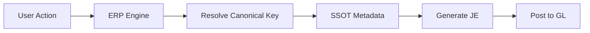

# ERP Engine Domain Wiki

## 🎯 Purpose

Documentation for ERP Engine business logic, posting rules, journal entry (JE) generation, and workflow automation.

**Domain Owner:** ERP Team × Finance Team

---

## 📚 Pages in This Domain

| Page | SSOT Refs | Status | Description |
|------|-----------|--------|-------------|
| [Sales Invoice Posting Rules](./posting-rules-sales-invoice.md) | `revenue_ifrs_core`, `sales_value_operational` | ✅ Draft-MVP | JE rules for invoice posting |
| [Inventory Adjustment Rules](./posting-rules-inventory-adjustment.md) | 🔜 TBD | 🔜 Planned | JE rules for inventory adjustments |
| [Payment Allocation Rules](./posting-rules-payment-allocation.md) | 🔜 TBD | 🔜 Planned | How payments allocate to invoices |

---

## 🔗 SSOT References

This domain primarily uses these canonical concepts:

- [`revenue_ifrs_core`](../../metadata-ssot/finance-revenue-matrix.md#1-revenue_ifrs_core) - Statutory revenue recognition
- [`sales_value_operational`](../../metadata-ssot/finance-revenue-matrix.md#4-sales_value_operational) - Operational sales tracking
- [`other_income_ifrs`](../../metadata-ssot/finance-revenue-matrix.md#2-other_income_ifrs) - Non-operating income

---

## 🏗️ How ERP Engine Uses SSOT

1. **User action** (e.g., post invoice)
2. **ERP Engine** determines which canonical concepts are involved
3. **Resolve** via Metadata SSOT (not hardcoded aliases)
4. **Generate JE** based on posting rules
5. **Post to GL** with correct account mapping

---

## 🚀 Quick Links

- [Metadata SSOT](../../metadata-ssot/index.md)
- [Revenue Matrix](../../metadata-ssot/finance-revenue-matrix.md)
- [Domain Wikis Home](../README.md)

---

**Owner:** ERP Team × Finance Team  
**Last Updated:** 2025-12-02

