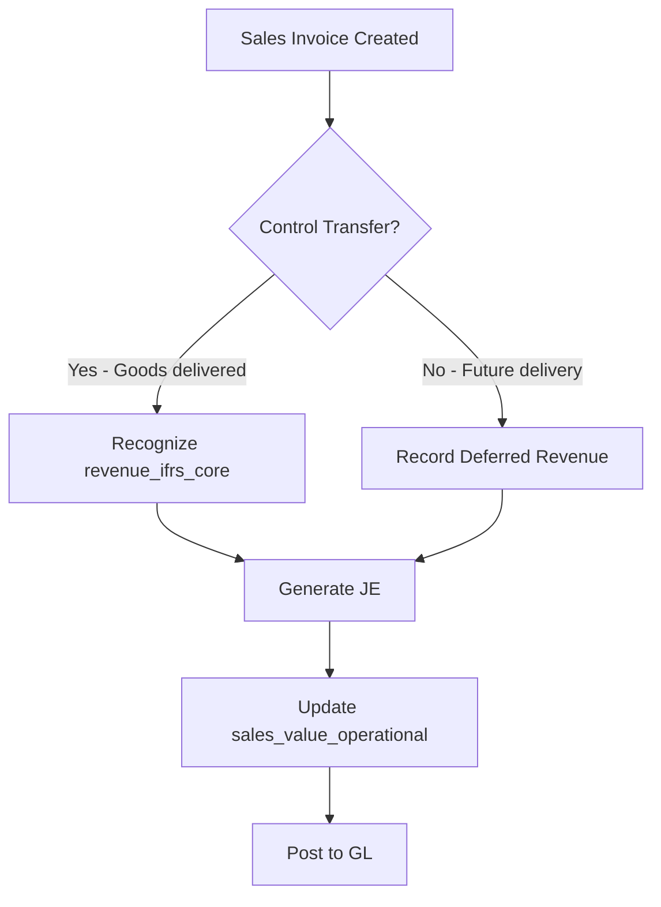

# Sales Invoice Posting Rules (ERP Engine)

## 🎯 Purpose

Defines how sales invoices generate Journal Entries (JE) in the ERP system, using canonical concepts from [Metadata SSOT](../../metadata-ssot/index.md).

**Audience:** Developers, Finance team, Auditors

---

## 📋 SSOT Concept References

This page uses these canonical concepts:

| Canonical Key | SSOT Definition | Usage in This Page |
|---------------|-----------------|-------------------|
| [`revenue_ifrs_core`](../../metadata-ssot/finance-revenue-matrix.md#1-revenue_ifrs_core) | Revenue per IFRS 15 | Statutory revenue recognition (control transfer) |
| [`sales_value_operational`](../../metadata-ssot/finance-revenue-matrix.md#4-sales_value_operational) | Operational sales value | Real-time sales tracking (invoice value) |
| [`sales_quantity_operational`](../../metadata-ssot/finance-revenue-matrix.md#5-sales_quantity_operational) | Quantity sold | Inventory tracking |

**Rule:** We NEVER invent new meanings for "Revenue" or "Sales" here. We reference SSOT definitions and show how to apply them.

---

## 🔄 Posting Flow Overview



---

## 📊 Posting Rules

### Scenario 1: Goods Delivered (Immediate Control Transfer)

**Condition:** Goods physically delivered to customer, control transferred per IFRS 15

**Canonical Concept:** [`revenue_ifrs_core`](../../metadata-ssot/finance-revenue-matrix.md#1-revenue_ifrs_core)

**Journal Entry:**

| Account | Debit | Credit | Canonical Ref |
|---------|-------|--------|---------------|
| Accounts Receivable | $1,000 | | (AR tracking) |
| Revenue | | $1,000 | `revenue_ifrs_core` |

**Code Example:**

```typescript
import { resolveNameForConcept } from '../naming';

async function postSalesInvoice(invoice: Invoice) {
  // 1. Resolve canonical concept name
  const revenueField = await resolveNameForConcept({
    canonicalKey: "revenue_ifrs_core",
    context: "typescript",
    tenantId: invoice.tenantId,
  });
  // Returns: "revenueIfrsCore"

  // 2. Generate JE
  const je = {
    entries: [
      {
        account: "1200", // AR
        debit: invoice.totalAmount,
        credit: 0,
      },
      {
        account: "4000", // Revenue
        debit: 0,
        credit: invoice.totalAmount,
        canonicalRef: "revenue_ifrs_core", // ✅ Link to SSOT
      },
    ],
  };

  // 3. Also update operational tracking
  await updateMetric({
    canonicalKey: "sales_value_operational",
    value: invoice.totalAmount,
    tenantId: invoice.tenantId,
  });

  return je;
}
```

---

### Scenario 2: Future Delivery (Deferred Revenue)

**Condition:** Invoice issued, but goods not yet delivered (control not transferred)

**Canonical Concepts:**
- Deferred Revenue (liability) - not revenue yet
- [`sales_value_operational`](../../metadata-ssot/finance-revenue-matrix.md#4-sales_value_operational) - operational tracking

**Journal Entry (at invoice date):**

| Account | Debit | Credit | Canonical Ref |
|---------|-------|--------|---------------|
| Accounts Receivable | $1,000 | | (AR tracking) |
| Deferred Revenue (Liability) | | $1,000 | (not `revenue_ifrs_core` yet) |

**Later, when goods delivered:**

| Account | Debit | Credit | Canonical Ref |
|---------|-------|--------|---------------|
| Deferred Revenue (Liability) | $1,000 | | |
| Revenue | | $1,000 | `revenue_ifrs_core` ✅ |

**Code Example:**

```typescript
async function recognizeRevenue(deferredInvoice: Invoice) {
  // Check control transfer rules (IFRS 15)
  const controlTransferred = await checkControlTransfer(deferredInvoice);

  if (!controlTransferred) {
    throw new Error(
      "Cannot recognize revenue_ifrs_core without control transfer (IFRS 15)"
    );
  }

  // Now recognize revenue using canonical concept
  const je = {
    entries: [
      {
        account: "2300", // Deferred Revenue
        debit: deferredInvoice.totalAmount,
        credit: 0,
      },
      {
        account: "4000", // Revenue
        debit: 0,
        credit: deferredInvoice.totalAmount,
        canonicalRef: "revenue_ifrs_core", // ✅ SSOT reference
      },
    ],
  };

  return je;
}
```

---

## 🚨 What NOT to Do

### ❌ Mistake 1: Using Hardcoded "Revenue" Without SSOT Reference

```typescript
// ❌ WRONG - ambiguous, not linked to SSOT
const revenue = invoice.amount;
await postToGL({ account: "4000", credit: revenue });
```

```typescript
// ✅ CORRECT - explicit canonical reference
await postToGL({
  account: "4000",
  credit: invoice.amount,
  canonicalRef: "revenue_ifrs_core", // Links to SSOT
});
```

---

### ❌ Mistake 2: Mixing Operational and Statutory Concepts

```typescript
// ❌ WRONG - using operational metric for statutory GL
const salesValue = await getMetric("sales_value_operational");
await postStatutoryRevenue(salesValue); // ☠️ Wrong concept!
```

```typescript
// ✅ CORRECT - keep contexts separate
const salesValue = await getMetric("sales_value_operational");
const statutoryRevenue = await getMetric("revenue_ifrs_core");

// Use in appropriate contexts
await updateDashboard({ sales: salesValue });
await postStatutoryGL({ revenue: statutoryRevenue });
```

---

### ❌ Mistake 3: Redefining Revenue in Code Comments

```typescript
// ❌ WRONG - redefining without SSOT reference
// Revenue = amount customer pays
const revenue = invoice.amount;
```

```typescript
// ✅ CORRECT - reference SSOT
// Revenue per IFRS 15 (control transfer)
// See: docs/metadata-ssot/finance-revenue-matrix.md#revenue_ifrs_core
const revenue = await resolveMetric("revenue_ifrs_core");
```

---

## 🔍 Control Transfer Rules (IFRS 15)

**When can we recognize [`revenue_ifrs_core`](../../metadata-ssot/finance-revenue-matrix.md#1-revenue_ifrs_core)?**

Control transfers when the customer can:

1. ✅ **Direct the use** of the asset
2. ✅ **Obtain substantially all benefits** from the asset

**Practical tests:**

| Scenario | Control Transferred? | Recognize Revenue? |
|----------|---------------------|-------------------|
| Goods delivered to customer warehouse | ✅ Yes | ✅ Yes → `revenue_ifrs_core` |
| Goods in transit (FOB shipping point) | ✅ Yes | ✅ Yes → `revenue_ifrs_core` |
| Goods in our warehouse (customer hasn't collected) | ❌ No | ❌ No → Deferred Revenue |
| Service performed, customer signed off | ✅ Yes | ✅ Yes → `revenue_ifrs_core` |
| Invoice raised, service not yet done | ❌ No | ❌ No → Deferred Revenue |

---

## 📊 Operational vs Statutory Tracking

| Metric | When Updated | Canonical Ref | Purpose |
|--------|-------------|---------------|---------|
| **Invoice Created** | ✅ Immediately | `sales_value_operational` | Operational dashboards |
| **Revenue Recognized** | ✅ When control transfers | `revenue_ifrs_core` | Statutory GL, tax returns |

**Example Timeline:**

```
Day 1: Invoice raised ($1,000)
  → sales_value_operational += $1,000 ✅
  → revenue_ifrs_core: NOT YET ❌

Day 5: Goods delivered
  → revenue_ifrs_core += $1,000 ✅

Operations Dashboard (Day 1): Shows $1,000 sales ✅
Statutory P&L (Day 1): Shows $0 revenue (not yet recognized) ✅
Statutory P&L (Day 5): Shows $1,000 revenue ✅
```

---

## 🏗️ Account Mapping

| GL Account | Description | Canonical Ref | Tier |
|------------|-------------|---------------|------|
| 4000 | Revenue from Contracts | `revenue_ifrs_core` | tier1 |
| 4100 | Other Income | `other_income_ifrs` | tier1 |
| 4900 | Gains (Non-Operating) | `gain_ifrs_other` | tier2 |
| 2300 | Deferred Revenue | (not revenue yet) | tier2 |

**See:** [Revenue SSOT Matrix](../../metadata-ssot/finance-revenue-matrix.md) for full definitions

---

## 🔗 Integration with Other Systems

### BI Dashboards

BI dashboards use [`sales_value_operational`](../../metadata-ssot/finance-revenue-matrix.md#4-sales_value_operational) for:
- Real-time sales tracking
- Salesperson performance
- Outlet performance

They DO NOT use `revenue_ifrs_core` (too slow, statutory timing).

### Tax Returns

Tax returns use [`revenue_ifrs_core`](../../metadata-ssot/finance-revenue-matrix.md#1-revenue_ifrs_core) for:
- Taxable revenue calculation
- Timing of revenue recognition
- Reconciliation with statutory accounts

### Audit Trail

Every JE entry includes `canonicalRef` field linking to SSOT concept:

```json
{
  "jeId": "JE-2025-001",
  "entries": [
    {
      "account": "4000",
      "credit": 1000,
      "canonicalRef": "revenue_ifrs_core",
      "ssotPage": "docs/metadata-ssot/finance-revenue-matrix.md"
    }
  ]
}
```

---

## 📋 Testing & Validation

### Unit Tests

```typescript
describe('Sales Invoice Posting', () => {
  it('should use revenue_ifrs_core for control transfer', async () => {
    const invoice = createTestInvoice({ delivered: true });
    const je = await postSalesInvoice(invoice);

    expect(je.entries[1].canonicalRef).toBe('revenue_ifrs_core');
  });

  it('should NOT recognize revenue without control transfer', async () => {
    const invoice = createTestInvoice({ delivered: false });
    const je = await postSalesInvoice(invoice);

    expect(je.entries[1].account).toBe('2300'); // Deferred Revenue
    expect(je.entries[1].canonicalRef).not.toBe('revenue_ifrs_core');
  });
});
```

---

## 🚀 Related Pages

- [Revenue SSOT Matrix](../../metadata-ssot/finance-revenue-matrix.md) - Canonical definitions
- [Inventory Adjustment Rules](./posting-rules-inventory-adjustment.md) - 🔜 Planned
- [Payment Allocation Rules](./posting-rules-payment-allocation.md) - 🔜 Planned

---

## 📚 External References

- **IFRS 15:** Revenue from Contracts with Customers
- **IAS 18:** Revenue (superseded by IFRS 15)
- **MFRS 15:** Malaysian equivalent

---

**Owner:** Finance × ERP Engine  
**Reviewers:** CFO, CID, ERP Architect  
**Last Updated:** 2025-12-02  
**Next Review:** 2026-Q1

