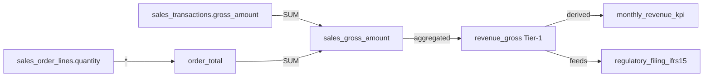

# Lineage Tracking - "Show Your Work" for Tier-1 Fields

## 🎯 Overview

The lineage system enables complete data provenance tracking, allowing you to:
- **Trace data sources** - Where does this critical field come from?
- **Impact analysis** - What breaks if I change this field?
- **Audit compliance** - Prove Tier-1 fields have documented lineage
- **Governance coverage** - Track which Tier-1 fields lack lineage

---

## 🏗️ Architecture

### Database Table: `mdm_lineage_field`

```sql
CREATE TABLE mdm_lineage_field (
  -- Edge identity
  id uuid PRIMARY KEY,
  tenant_id uuid NOT NULL,
  
  -- Lineage relationship (source → target)
  source_metadata_id uuid NOT NULL REFERENCES mdm_global_metadata(id),
  target_metadata_id uuid NOT NULL REFERENCES mdm_global_metadata(id),
  
  -- Relationship semantics
  relationship_type text NOT NULL,  -- 'direct', 'derived', 'aggregated', 'lookup', 'manual'
  transformation_type text,         -- 'aggregation', 'fx_translation', 'allocation', 'join'
  transformation_expression text,   -- "SUM(sales.amount)", "amount * fx_rate"
  
  -- Path and confidence
  is_primary_path boolean DEFAULT true,
  confidence_score integer DEFAULT 100,  -- 0-100
  
  -- Verification
  verified boolean DEFAULT false,
  verified_by text,
  verified_at timestamp,
  
  -- Audit trail
  created_at timestamp DEFAULT now(),
  updated_at timestamp DEFAULT now(),
  created_by text NOT NULL,
  updated_by text NOT NULL,
  
  -- Unique constraint
  UNIQUE (tenant_id, source_metadata_id, target_metadata_id, relationship_type)
);
```

**Key Features:**
- ✅ Field-level granularity (not just table-level)
- ✅ Multiple relationship types (direct copy, transformation, aggregation, etc.)
- ✅ Transformation logic captured (formulas, SQL snippets)
- ✅ Primary path flagging (handle alternative derivations)
- ✅ Confidence scoring (auto-detected vs manually verified)
- ✅ Verification workflow (similar to metadata approval)

---

## 📊 Relationship Types

| Type | Description | Example |
|------|-------------|---------|
| **direct** | 1:1 copy from source | `revenue_gross ← sales.gross_amount` |
| **derived** | Transformed with formula | `revenue_net ← revenue_gross - discounts` |
| **aggregated** | Sum/avg/min/max over source | `monthly_revenue ← SUM(daily_sales.amount)` |
| **lookup** | Enriched via dimension/lookup | `product_category ← products.category_id → categories.name` |
| **manual** | Manually curated/entered | Data steward manually defines relationship |

---

## 🔌 API Endpoints

### 1. Declare Field Lineage

**`POST /lineage/field`**

Create or update a lineage edge using canonical keys (not UUIDs).

**Request:**
```bash
curl -X POST http://localhost:8787/lineage/field \
  -H "Content-Type: application/json" \
  -H "x-tenant-id: 123e4567-e89b-12d3-a456-426614174000" \
  -H "x-user-id: steward@company.com" \
  -H "x-role: metadata_steward" \
  -d '{
    "sourceCanonicalKey": "sales_gross_amount",
    "targetCanonicalKey": "revenue_gross",
    "relationshipType": "aggregated",
    "transformationType": "aggregation",
    "transformationExpression": "SUM(sales.gross_amount)",
    "isPrimaryPath": true,
    "confidenceScore": 100,
    "verified": true
  }'
```

**Response:** HTTP 200
```json
{
  "id": "...",
  "tenantId": "123e4567-e89b-12d3-a456-426614174000",
  "sourceMetadataId": "...",
  "targetMetadataId": "...",
  "relationshipType": "aggregated",
  "transformationExpression": "SUM(sales.gross_amount)",
  "verified": true,
  ...
}
```

---

### 2. Query Field Lineage Graph

**`GET /lineage/field?canonicalKey={key}&direction={upstream|downstream|both}`**

Retrieve upstream sources or downstream dependencies for a field.

**Upstream Query (Where does this come from?):**
```bash
curl "http://localhost:8787/lineage/field?canonicalKey=revenue_gross&direction=upstream" \
  -H "x-tenant-id: 123e4567-e89b-12d3-a456-426614174000"
```

**Response:**
```json
{
  "target": {
    "id": "...",
    "canonicalKey": "revenue_gross",
    "label": "Gross Revenue",
    "tier": "tier1",
    ...
  },
  "upstream": [
    {
      "edge": {
        "relationshipType": "aggregated",
        "transformationExpression": "SUM(sales.gross_amount)",
        ...
      },
      "source": {
        "canonicalKey": "sales_gross_amount",
        "label": "Sales Gross Amount",
        "tier": "tier3",
        ...
      }
    },
    {
      "edge": {
        "relationshipType": "derived",
        "transformationExpression": "daily_revenue * fx_rate",
        ...
      },
      "source": {
        "canonicalKey": "daily_revenue_local",
        "label": "Daily Revenue (Local Currency)",
        ...
      }
    }
  ],
  "downstream": []
}
```

**Downstream Query (What depends on this?):**
```bash
curl "http://localhost:8787/lineage/field?canonicalKey=sales_gross_amount&direction=downstream" \
  -H "x-tenant-id: 123e4567-e89b-12d3-a456-426614174000"
```

**Response:**
```json
{
  "target": {
    "canonicalKey": "sales_gross_amount",
    "label": "Sales Gross Amount",
    ...
  },
  "upstream": [],
  "downstream": [
    {
      "edge": {
        "relationshipType": "aggregated",
        "transformationExpression": "SUM(sales.gross_amount)",
        ...
      },
      "target": {
        "canonicalKey": "revenue_gross",
        "label": "Gross Revenue",
        "tier": "tier1",
        ...
      }
    },
    {
      "edge": {
        "relationshipType": "aggregated",
        "transformationExpression": "SUM(gross_amount)",
        ...
      },
      "target": {
        "canonicalKey": "monthly_revenue_kpi",
        "label": "Monthly Revenue KPI",
        "tier": "tier1",
        ...
      }
    }
  ]
}
```

---

### 3. Tier-1 Lineage Coverage Report

**`GET /lineage/tier1-coverage`**

Audit report showing which Tier-1 fields have lineage documented.

**Request:**
```bash
curl http://localhost:8787/lineage/tier1-coverage \
  -H "x-tenant-id: 123e4567-e89b-12d3-a456-426614174000"
```

**Response:**
```json
{
  "totalTier1": 25,
  "covered": 18,
  "uncovered": 7,
  "uncoveredCanonicalKeys": [
    "revenue_gross",
    "cogs_total",
    "inventory_valuation",
    "fx_gain_realized",
    "tax_current_expense",
    "dividend_payable",
    "ebitda"
  ]
}
```

**Use Case:** 
- Compliance dashboard showing % of Tier-1 fields with lineage
- Alert when critical fields lack provenance
- Governance KPI tracking

---

## 💡 Use Cases

### Use Case 1: IFRS Revenue Recognition

**Scenario:** CFO needs to prove `revenue_gross` (Tier-1) is calculated correctly per IFRS 15.

**Lineage Graph:**
```
revenue_gross (Tier-1, IFRS_15_REV)
  ← SUM(sales_transactions.gross_amount)
      ← sales_order_lines.unit_price * sales_order_lines.quantity
          ← product_catalog.list_price
          ← customer_orders.quantity
```

**API Call:**
```bash
GET /lineage/field?canonicalKey=revenue_gross&direction=upstream
```

**Benefit:** Complete audit trail from source transactions to financial statements.

---

### Use Case 2: Impact Analysis

**Scenario:** Data engineer wants to change `sales_gross_amount` calculation. What breaks?

**Lineage Graph:**
```
sales_gross_amount (Tier-3)
  → revenue_gross (Tier-1)
  → monthly_revenue_kpi (Tier-1)
  → quarterly_board_report (Tier-2)
  → regulatory_filing_ifrs15 (Tier-1)
```

**API Call:**
```bash
GET /lineage/field?canonicalKey=sales_gross_amount&direction=downstream
```

**Benefit:** Know exactly what downstream reports/KPIs will be affected before making changes.

---

### Use Case 3: Multi-Hop Lineage

**Scenario:** Trace `ebitda` (Tier-1 KPI) back to source transactions.

**Lineage Chain:**
```
ebitda (Tier-1)
  ← revenue_gross - cogs_total - opex_total + interest_income
      ← revenue_gross
          ← SUM(sales_transactions.gross_amount)
              ← ERP_CORE.sales.transactions.amount
      ← cogs_total
          ← SUM(inventory_consumed.unit_cost * quantity)
      ← opex_total
          ← SUM(gl_entries.amount WHERE account_type='operating_expense')
```

**API Call:**
```bash
# First hop
GET /lineage/field?canonicalKey=ebitda&direction=upstream

# Second hop for each source
GET /lineage/field?canonicalKey=revenue_gross&direction=upstream
GET /lineage/field?canonicalKey=cogs_total&direction=upstream
GET /lineage/field?canonicalKey=opex_total&direction=upstream
```

**Benefit:** Full end-to-end traceability from KPI to raw transactions.

---

## 🎨 Visualization Examples

### For Retool / Frontend

The API returns structured data perfect for graph visualization libraries like:
- **D3.js** - Force-directed graphs
- **Cytoscape.js** - Network diagrams
- **React Flow** - Interactive lineage graphs
- **Mermaid** - Auto-generated diagrams

**Example Mermaid Diagram:**


---

## 🔒 Governance Features

### 1. Role-Based Lineage Declaration

Only these roles can declare lineage:
- `kernel_architect`
- `metadata_steward`
- `business_admin`

**Enforced in:** `lineage.service.ts` → `canDeclareLineage()`

### 2. Verification Workflow

Similar to metadata approval:
```typescript
// Declare lineage (unverified)
POST /lineage/field
{
  "verified": false,
  ...
}

// Later, kernel_architect verifies
POST /lineage/field
{
  "verified": true,
  "verifiedBy": "cfo@company.com",
  "verifiedAt": "2025-12-01T12:00:00Z"
}
```

### 3. Confidence Scoring

Track lineage quality:
- **100** - Manually verified by steward
- **80-99** - Auto-detected, high confidence
- **50-79** - Auto-detected, medium confidence
- **<50** - Requires manual review

---

## 📋 Best Practices

### 1. Start with Tier-1 Fields

Focus lineage efforts on critical Tier-1 fields first:
```bash
# Get list of uncovered Tier-1 fields
GET /lineage/tier1-coverage

# Systematically document each one
POST /lineage/field (for each uncovered field)
```

### 2. Use Transformation Expressions

Always include transformation logic:
```json
{
  "transformationExpression": "SUM(sales.gross_amount)",
  "transformationType": "aggregation"
}
```

**Bad:**
```json
{
  "relationshipType": "aggregated"
  // Missing: HOW is it aggregated?
}
```

### 3. Mark Primary Paths

If multiple derivation paths exist, mark the primary one:
```json
{
  "sourceCanonicalKey": "sales_gross_amount",
  "targetCanonicalKey": "revenue_gross",
  "isPrimaryPath": true
}
```

### 4. Capture All Hops

Don't skip intermediate fields:
```
✅ Good:
  transactions → daily_sales → monthly_revenue → annual_revenue

❌ Bad:
  transactions → annual_revenue (skipped intermediate aggregations)
```

---

## 🚀 Next Steps

### Phase 1: Document Tier-1 Lineage ✅
- Use `/lineage/tier1-coverage` to identify uncovered fields
- Declare lineage for all Tier-1 fields
- Target: 100% Tier-1 coverage

### Phase 2: Build Lineage UI 🎨
- Retool graph visualization
- Interactive lineage explorer
- One-click "trace to source" feature

### Phase 3: Auto-Detection 🤖
- Parse SQL queries to extract lineage
- Scan dbt models for transformations
- Auto-populate lineage edges (confidence < 100)

### Phase 4: Impact Analysis Alerts ⚠️
- Alert on Tier-1 field changes
- Show downstream impact automatically
- Require approval for high-impact changes

---

## 🎉 What You Have Now

✅ **Complete lineage tracking system**  
✅ **Field-level granularity**  
✅ **Transformation logic capture**  
✅ **Upstream/downstream queries**  
✅ **Tier-1 coverage auditing**  
✅ **Verification workflow**  
✅ **Role-based access control**  
✅ **Ready for graph visualization**  

**This is the "show your work" layer that makes Tier-1 fields audit-ready!** 🚀

